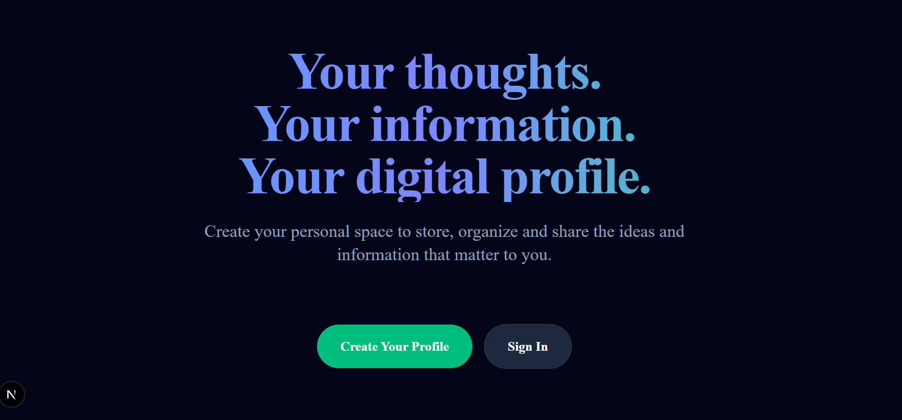
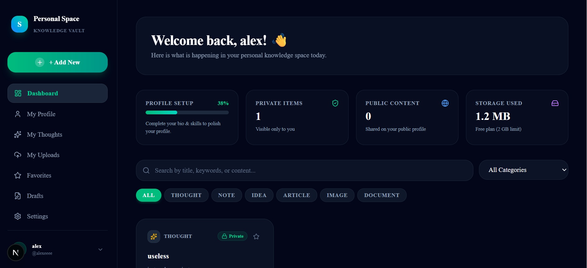
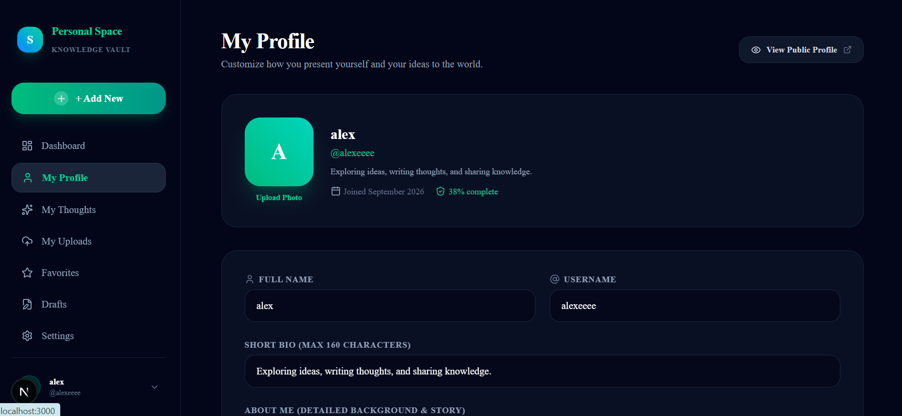

# Thoughts Uselesss (Saidalis) 🎯

## Basic Details
### Team Name: [pereira]

### Team Members
- Team Lead: [saidali] - [snm imt maliyankara]
- Member 2: [antony jackson pereira] - [snm imt maliyankara]
- Member 3: [name] - [collage]

### Project Description
The site is useful for sharing our thoughts, ideas, and information. It provides a personal space to securely capture, organize, and share your notes, ideas, and documents with flexible privacy controls.

### The Problem (that doesn't exist)
Having thousands of brilliant, random, and completely useless 3 AM shower thoughts, epiphanies, and ideas with nowhere dedicated to dump them before they are forgotten forever.

### The Solution (that nobody asked for)
A full-stack, cloud-connected digital vault and personal profile web app where you can categorize, tag, lock away, or publicly broadcast every single thought, idea, and document with real-time privacy controls and Supabase PostgreSQL persistence!

---

## Technical Details
### Technologies/Components Used
For Software:
- **Languages:** TypeScript, JavaScript, HTML, CSS, SQL
- **Frameworks:** Next.js 16 (App Router), React 19
- **Libraries:** NextAuth.js, Prisma ORM, Tailwind CSS, Lucide React, bcryptjs
- **Tools:** Supabase (PostgreSQL Server), Vercel, Git/GitHub, PWA Service Worker

---

### Implementation
For Software:

# Installation
```bash
npm install
```

# Run
```bash
npx prisma db push
npm run dev
```

Open [http://localhost:3000](http://localhost:3000) in your browser.

---

### Project Documentation
For Software:

# Screenshots (Add at least 3)

*Landing page showcasing the value proposition and onboarding.*


*Personal knowledge space dashboard showing thoughts, privacy statuses, and storage usage.*


*User profile management page for customizing digital bio and public presence.*

# Diagrams
```
[Client / PWA Browser] 
        │
        ▼ (HTTPS / API Routes)
[Next.js App Router Server] ─── (NextAuth.js Session)
        │
        ▼ (Prisma ORM)
[Supabase Cloud PostgreSQL Database]
```
*Architecture & data flow showing client requests passing through Next.js App Router and Prisma to the Supabase cloud database.*

---

### Project Demo
# Video
[https://drive.google.com/file/d/1g-gTaFyRDKNE3RFywRxymCXGYiG92QEF/view?usp=sharing](https://drive.google.com/file/d/1g-gTaFyRDKNE3RFywRxymCXGYiG92QEF/view?usp=sharing)
*Video demonstrating the user registration, dashboard overview, thought creation, and profile customization.*

# Additional Demos
- Live Web App: [Deploy on Vercel]

---

## Team Contributions
- **saidali:** Lead development, backend architecture, NextAuth authentication, and Supabase database integration.
- **antony jackson pereira:** Frontend UI/UX, responsive dashboard design, PWA configuration, and component integration.
- **Member 3:** Testing, documentation, and ideation.

---
Made with ❤️ at TinkerHub Useless Projects 


